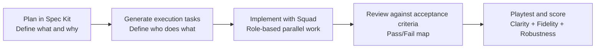

# SquadSDD Workshop — Spec First, Team Implementation Next

Learn spec-driven development by building a text-adventure game with a coordinated multi-agent Squad.

This repository is designed for audiences that are new to these concepts:

- What is spec-driven development?
- What is Spec Kit, the tool this workshop uses to write a spec?
- What is Squad, and why use multiple agents instead of one chat?

The workshop answers these through a practical flow: write a durable spec first, then implement directly from that spec with role-based agents.

---

## What This Workshop Teaches

### 1) Spec-driven development, in plain language

Spec-driven development means you define the problem and expected behavior before implementation.
The spec is a version-controlled artifact that captures:

- What should happen
- Why it should happen
- What is explicitly out of scope
- How to verify done (acceptance criteria)

If the spec is vague, teams and agents interpret requirements differently. If the spec is clear, implementation aligns faster with less rework.

Three terms you will use throughout (the Before You Begin checklist assumes you can tell them apart):

- **Requirement:** something the system must do; it is not optional. Example: "command parsing must be case-insensitive."
- **Assumption:** something you treat as true because the spec did not say. Write it down so others can challenge it. Example: "if two items share a name, `take` picks the first match."
- **Acceptance criterion:** a concrete, testable check that proves a requirement is met, usually written Given / When / Then. Example: "Given mixed-case input, when the player runs `GO EAST`, then the command is processed as valid."

Spec-driven development is not waterfall. The spec is living: when you discover a gap, you change the spec first and then the code, so intent and implementation never drift apart. The alternative, jumping straight to code, decides behavior implicitly, and every person or agent fills the gaps differently.

### 2) Spec Kit, the tool you plan with

Spec Kit is GitHub's open-source tool for doing spec-driven development. Instead of writing a spec as one freeform document, it walks you through four ordered files, each answering a single question:

| Artifact | Question it answers | Plain meaning |
|---|---|---|
| `constitution` | What rules always hold? | Guardrails and principles the whole project must respect |
| `spec` | What and why? | The behavior you want and the reason for it |
| `plan` | How? | The technical approach and workstream breakdown |
| `tasks` | In what steps? | An ordered, checkable to-do list for implementation |

**"Phase-gated"** means you finish one phase before starting the next: you do not draft tasks until the spec is settled, and you do not draft the spec until the constitution sets the guardrails. That ordering is the whole point. It stops you from coding before intent is clear, which is exactly the drift that spec-driven development exists to prevent.

You run Spec Kit on demand with `uvx` (nothing to install) and drive it with slash commands in Copilot: `/speckit.constitution`, `/speckit.specify`, `/speckit.plan`, `/speckit.tasks`. Lab 01 has the exact commands.

> **Tool vs folder.** The answer key in `specs/speckit/` is named after the tool: its four files (`constitution.md`, `spec.md`, `plan.md`, `tasks.md`) are a completed Spec Kit artifact chain. So even if you take the fast path in Lab 01 and never run the tool yourself, the reference you adopt is Spec Kit's output.

### 3) Squad, in plain language

Squad is a coordinated team of specialized agents.
Instead of one general assistant doing everything, work is routed by role:

- frontend
- backend
- docs
- tests
- devops
- reviewer
- architect
- security

This mirrors how real software teams collaborate.

---

## Through-Line



The key habit: implementation is governed by the specification, not by ad hoc prompting.

---

## What You Will Produce (~60 minutes)

Working solo or as a team, in about an hour:

- A spec you adopted or authored (Plan, ~20 min)
- A Squad-built **vertical slice** of the game, tests passing (Implement, ~30 min)
- A rubric score for that slice (~10 min)

The full game (items, lock-and-key, win condition) is stretch — see Lab 02.

---

## Workshop Stations

| Station | Time | Purpose | Start Here |
|---|---|---|---|
| Plan | ~20 min | Adopt or author the spec that governs implementation | [labs/01-spec/README.md](labs/01-spec/README.md) |
| Implement | ~30 min | Build one vertical slice from the spec with role routing | [labs/02-squad/README.md](labs/02-squad/README.md) |

Solo or facilitated? Both work. Facilitated groups split into spec-author and
implementation teams and score each other; solo learners score their own slice
against the reference spec. Participant materials intentionally avoid
timestamped execution plans.

---

## Running Example: Escape the Labyrinth

Teams build a small text adventure where the player navigates rooms,
collects items, and uses dependencies to reach a win condition.

Core command set:

- `look`
- `go <direction>`
- `take <item>`
- `use <item> <target>`
- `inventory`

Why this scenario works for teaching:

- Room graph and exits force precise scope definition
- Item dependencies force clear prerequisites and edge-case behavior
- Win condition forces explicit acceptance criteria

---

## Repository Layout (Guided)

```text
squadsdd-workshop/
├── README.md                          # Overview and onboarding path
├── prerequisites.md                   # Tools and local readiness checks
│
├── app/                               # Game workspace (Python + uv) the Squad builds in
│   ├── README.md                      # How to run and test the game
│   ├── pyproject.toml                 # uv project + pytest config
│   ├── main.py                        # Entry point (UI → engine)
│   ├── src/game/                      # backend-owned: rooms, items, parser, win logic
│   ├── src/ui/                        # frontend-owned: play loop and rendering
│   └── tests/                         # tests-owned: smoke + acceptance scenarios
│
├── scripts/
│   ├── preflight.sh                   # One-shot environment readiness check (macOS/Linux)
│   └── preflight.ps1                  # Same checks for Windows (PowerShell)
│
├── .copilot/
│   └── skills/
│       └── spec-to-tasks/SKILL.md     # Turn a spec into a task checklist
│
├── docs/
│   ├── plan.md                        # Workshop design notes (no timestamped run sheet)
│   └── tasks/                         # spec-to-tasks output lands here (git-ignored)
│
├── specs/
│   └── speckit/                       # Reference solutions (answer key) — see Lab 01
│       ├── constitution.md            # Principles and constraints
│       ├── spec.md                    # Functional requirements + acceptance scenarios
│       ├── plan.md                    # Workstream breakdown
│       └── tasks.md                   # Executable checklist for implementation
│
├── .squad/
│   ├── config.json                    # Model assignment by role
│   ├── team.md                        # Team roster and responsibilities
│   ├── routing.md                     # How prompts map to roles
│   ├── decisions.md                   # Durable team rules and decisions
│   ├── casting/
│   │   └── registry.json              # Registered squad agent metadata
│   └── agents/
│       ├── frontend/charter.md        # UI ownership
│       ├── backend/charter.md         # Game logic ownership
│       ├── docs/charter.md            # Participant-facing docs ownership
│       ├── tests/charter.md           # Acceptance and regression tests ownership
│       ├── devops/charter.md          # CI/automation ownership
│       ├── reviewer/charter.md        # Quality gate ownership
│       ├── architect/charter.md       # Scope/system integrity ownership
│       └── security/charter.md        # Input safety/risk checks ownership
│
├── .github/
│   ├── agents/
│   │   └── squad.agent.md             # Squad coordinator discovery file
│   └── workflows/
│       └── ci.yml                     # Runs app/ tests on push and PR
│
├── labs/
│   ├── 01-spec/
│   │   └── README.md                  # Plan station instructions
│   └── 02-squad/
│       └── README.md                  # Implement station instructions
│
├── materials/
│   ├── spec-template.md               # Spec writing helper
│   └── scoring-rubric.md              # Playtest scoring sheet
│
└── facilitator/
    └── run-of-show.md                 # Delivery sequence and facilitation prompts
```

### If you are new, read the repo in this order

1. [prerequisites.md](prerequisites.md)
2. [labs/01-spec/README.md](labs/01-spec/README.md)
3. [specs/speckit/spec.md](specs/speckit/spec.md)
4. [.squad/team.md](.squad/team.md)
5. [labs/02-squad/README.md](labs/02-squad/README.md)
6. [materials/scoring-rubric.md](materials/scoring-rubric.md)

---

## Quick Start

> **Shell note:** command blocks are labeled `bash`, but they run the same in
> **PowerShell 7+** — only where they differ (like the pre-flight script) is a
> separate Windows block shown.

**macOS / Linux (bash):**

```bash
# 1) Install the tools (see prerequisites.md for details)
npm install -g @bradygaster/squad-cli @github/copilot
gh auth login

# 2) Move to the workshop folder and validate the whole environment
cd squadsdd-workshop
./scripts/preflight.sh          # checks tools, auth, app/ tests, and squad doctor

# 3) Run Plan station (author a spec with Spec Kit)
cat labs/01-spec/README.md

# 4) Run Implement station (launch the Squad — interactive shell, 'quit' to exit)
cat labs/02-squad/README.md
squad
```

**Windows (PowerShell 7+):**

```powershell
# 1) Install the tools (see prerequisites.md for details)
npm install -g @bradygaster/squad-cli @github/copilot
gh auth login

# 2) Move to the workshop folder and validate the whole environment
cd squadsdd-workshop
./scripts/preflight.ps1         # checks tools, auth, app/ tests, and squad doctor

# 3) Run Plan station (author a spec with Spec Kit)
Get-Content labs/01-spec/README.md

# 4) Run Implement station (launch the Squad — interactive shell, 'quit' to exit)
Get-Content labs/02-squad/README.md
squad
```

> New to the tools? `squad` opens an interactive session you talk to in plain
> language; in VS Code you can instead pick the **Squad** agent in Copilot Chat.

---

## Before You Begin Checklist

- [ ] You can explain the difference between requirement, assumption, and acceptance criterion (see [the definitions above](#1-spec-driven-development-in-plain-language)).
- [ ] You have read [prerequisites.md](prerequisites.md) and the pre-flight check passes (`./scripts/preflight.sh`, or `./scripts/preflight.ps1` on Windows).
- [ ] `squad doctor` passes in this repository.
- [ ] You understand that `specs/speckit/` holds **reference solutions**; in Lab 01 you author your own.
- [ ] You will treat the designated `spec.md` as the implementation contract.

---

## Common Beginner Questions

### Do I need to know Squad internals first?
No. Start with [labs/01-spec/README.md](labs/01-spec/README.md), then use [labs/02-squad/README.md](labs/02-squad/README.md). The workshop teaches the Squad model as you run it.

### Why not just code right away?
Because this workshop is about reducing drift. The spec creates shared intent before implementation starts.

### What if behavior is missing from the spec?
Record it as an explicit assumption and include it in the final handoff output.

### Are the files in `specs/speckit/` the answer?
Yes — they're **reference solutions** (an answer key). In Lab 01 you author your
own spec and compare it against them. In Lab 02 the Squad implements against the
spec your facilitator designates as the source of truth.

### Is the game already built?
No. `app/` is a runnable **starter skeleton** — the structure and tests are wired
up, but the game logic is a stub. The Squad implements it from the spec in Lab 02.

---

## Where to Go Next

- Expand the game spec with optional mechanics and test whether clarity stays high.
- Add custom Squad skills for your own team workflow.
- Reuse this structure in your own repository with your own product domain.
